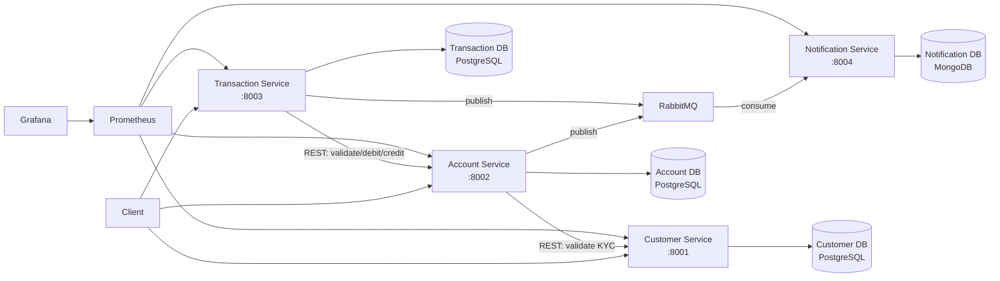

# Banking Microservices System

A polyglot microservices-based banking application demonstrating database-per-service architecture, inter-service communication via REST and RabbitMQ, containerized deployment with Docker and Kubernetes (Minikube), and observability with Prometheus and Grafana.

## Tech Stack

| Service | Language | Framework | Database | Port |
|---------|----------|-----------|----------|------|
| Customer Service | Python 3.12 | FastAPI | PostgreSQL 16 | 8001 |
| Account Service | Java 21 | Spring Boot 3.x | PostgreSQL 16 | 8002 |
| Transaction Service | Node.js 20 | Express + TypeScript | PostgreSQL 16 | 8003 |
| Notification Service | Python 3.12 | Flask | MongoDB 7 | 8004 |

**Shared Infrastructure:** RabbitMQ 3.13, Prometheus, Grafana

## Prerequisites

- Docker Desktop >= 4.0 (with Docker Compose V2)
- Minikube >= 1.32 (for Kubernetes deployment)
- kubectl >= 1.28

## Quick Start (Docker Compose)

```bash
git clone <repository-url>
cd banking-system
docker compose up --build -d
```

Wait for all services to become healthy:

```bash
docker compose ps
```

Verify all services are running:

```bash
curl http://localhost:8001/health  # Customer Service
curl http://localhost:8002/health  # Account Service
curl http://localhost:8003/health  # Transaction Service
curl http://localhost:8004/health  # Notification Service
```

## Architecture



## Service Endpoints

### Customer Service (port 8001)

| Method | Endpoint | Description |
|--------|----------|-------------|
| POST | /api/v1/customers | Create customer |
| GET | /api/v1/customers | List customers (paginated) |
| GET | /api/v1/customers/{id} | Get customer by ID |
| PUT | /api/v1/customers/{id} | Update customer |
| DELETE | /api/v1/customers/{id} | Soft-delete customer |
| PATCH | /api/v1/customers/{id}/kyc | Update KYC status |

### Account Service (port 8002)

| Method | Endpoint | Description |
|--------|----------|-------------|
| POST | /api/v1/accounts | Create account |
| GET | /api/v1/accounts | List accounts (paginated) |
| GET | /api/v1/accounts/{id} | Get account details |
| GET | /api/v1/accounts/{id}/balance | Get balance |
| PATCH | /api/v1/accounts/{id}/status | Update status |

### Transaction Service (port 8003)

| Method | Endpoint | Description |
|--------|----------|-------------|
| POST | /api/v1/transactions/deposit | Process deposit |
| POST | /api/v1/transactions/withdrawal | Process withdrawal |
| POST | /api/v1/transactions/transfer | Process transfer (idempotent) |
| GET | /api/v1/transactions | List transactions (paginated) |
| GET | /api/v1/accounts/{accountId}/statements | Account statement |

### Notification Service (port 8004)

| Method | Endpoint | Description |
|--------|----------|-------------|
| GET | /api/v1/notifications | List notifications |
| GET | /api/v1/notifications/{id} | Get notification |

## Monitoring

| Tool | URL | Credentials |
|------|-----|-------------|
| Prometheus | http://localhost:9090 | N/A |
| Grafana | http://localhost:3000 | admin / admin |
| RabbitMQ Management | http://localhost:15672 | guest / guest |

## Kubernetes Deployment (Minikube)

```bash
minikube start --cpus=4 --memory=8192
bash banking-infra/k8s/deploy-all.sh
```

Verify pods:

```bash
kubectl -n banking-system get pods
kubectl -n banking-system get svc
```

## Repository Structure

```
banking-system/
  banking-customer-service/   # Python/FastAPI (Member 1)
  banking-account-service/    # Java/Spring Boot (Member 2)
  banking-transaction-service/ # Node.js/TypeScript (Member 3)
  banking-notification-service/ # Python/Flask (Member 4)
  banking-infra/              # Shared infra configs
  bank_Dataset/               # Seed CSV files
  docker-compose.yml          # Full-system orchestration
```

## Data Seeding

Each service includes seed scripts that load from `bank_Dataset/`:

- `bank_customers.csv` - 60 customers
- `bank_accounts.csv` - 88 accounts
- `bank_transactions.csv` - 300 transactions

## Troubleshooting

**Port conflicts:** Ensure ports 8001-8004, 5433-5435, 27017, 5672, 15672, 9090, 3000 are free.

**Docker memory:** Allocate at least 8GB RAM to Docker Desktop for running all services.

**Service startup order:** Docker Compose handles dependencies via `depends_on` with health checks. If a service fails, check `docker compose logs <service-name>`.
