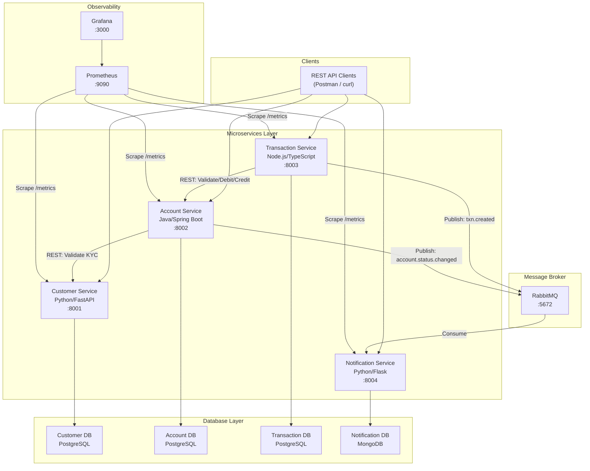
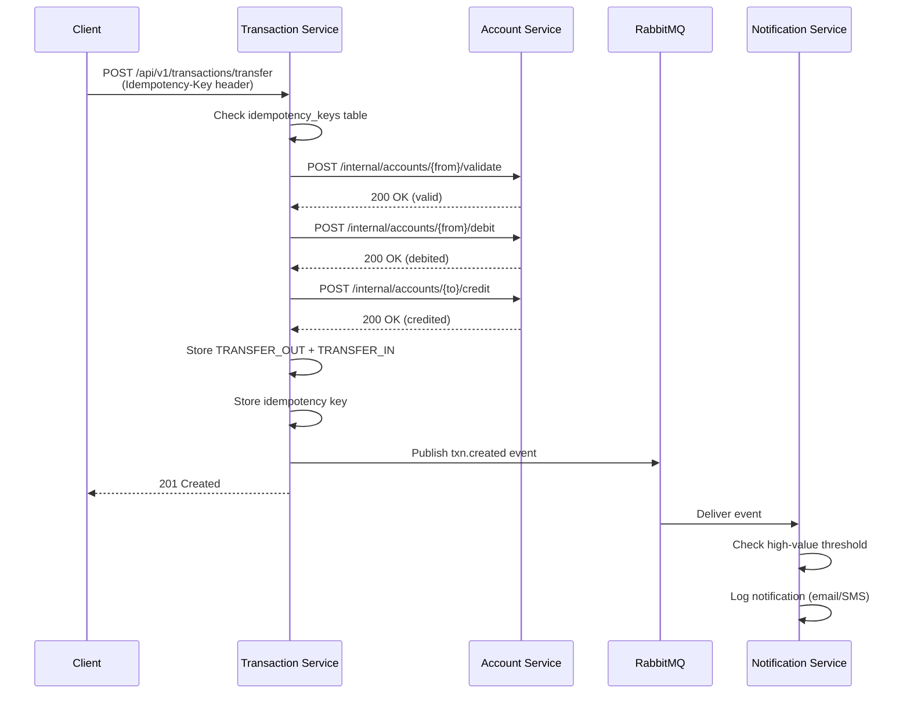
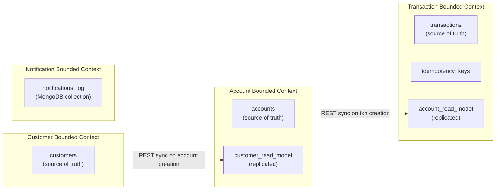
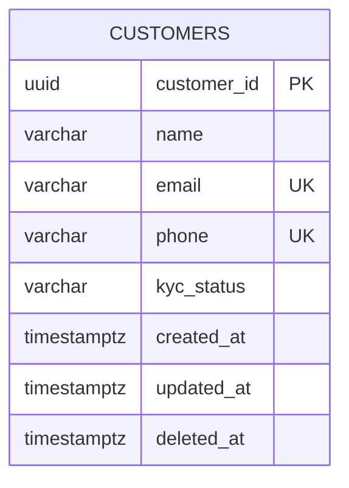
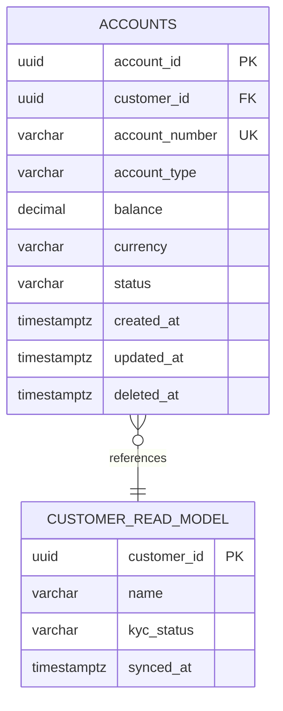
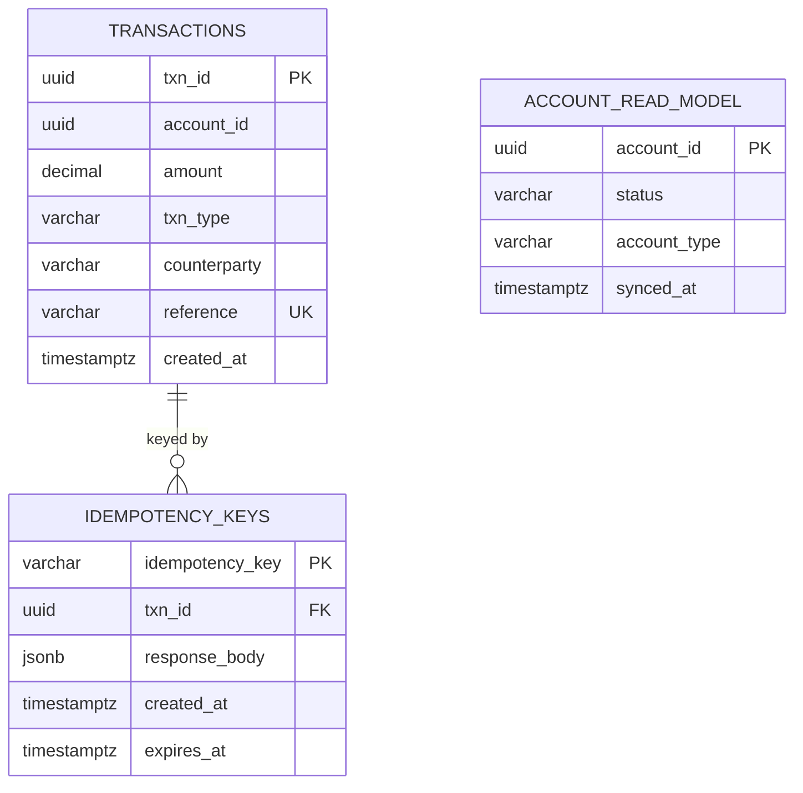
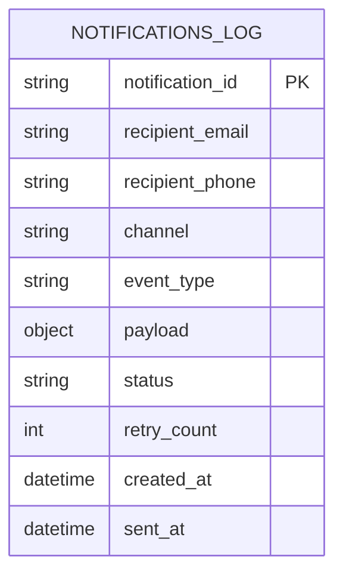

# Banking Microservices System - Documentation

## 1. Group Details and Individual Contributions

| Member | Service Owned | Contribution |
|--------|---------------|-------------|
| Member 1 | Customer Service (Python/FastAPI) | 25% |
| Member 2 | Account Service (Java/Spring Boot) | 25% |
| Member 3 | Transaction Service (Node.js/TypeScript) | 25% |
| Member 4 | Notification Service (Python/Flask) + Shared Infrastructure | 25% |

## 2. Application Description

The Banking Microservices System is a polyglot, distributed banking application that demonstrates microservices architecture patterns. It manages customer profiles, bank accounts, financial transactions (deposits, withdrawals, fund transfers), and real-time notifications for high-value transactions and account status changes.

The system enforces critical business rules: KYC verification before account opening, overdraft prevention for savings/salary accounts, daily transfer limits (INR 200,000), idempotent fund transfers, and automated high-value transaction alerts (threshold: INR 50,000).

### Key Design Decisions

- **Database-per-Service:** Each microservice owns its database schema with no shared tables
- **Polyglot Architecture:** Four different technology stacks demonstrate breadth (Python, Java, Node.js)
- **Event-Driven Notifications:** RabbitMQ decouples transaction processing from notification delivery
- **Idempotent Transfers:** Prevents duplicate financial transactions via idempotency keys with 24-hour TTL
- **Zero Trust:** All inputs validated at service boundaries; PII masked in logs

## 3. System Architecture

### 3.1 High-Level Architecture Diagram



### 3.2 Inter-Service Communication

**Synchronous (REST):**
- Account Service calls Customer Service to validate KYC status during account creation
- Transaction Service calls Account Service to validate balances, debit source accounts, and credit destination accounts

**Asynchronous (RabbitMQ):**
- Transaction Service publishes `txn.created` events after successful transactions
- Account Service publishes `account.status.changed` events on status updates
- Notification Service consumes both event types and generates alerts

### 3.3 Transfer Workflow (Sequence Diagram)



## 4. Database Design

### 4.1 Data Ownership Context Map



### 4.2 ER Diagrams

#### Customer Service ER



#### Account Service ER



#### Transaction Service ER



#### Notification Service (MongoDB)



### 4.3 Seed Data

| Dataset | Records | File |
|---------|---------|------|
| Customers | 60 | bank_Dataset/bank_customers.csv |
| Accounts | 88 | bank_Dataset/bank_accounts.csv |
| Transactions | 300 | bank_Dataset/bank_transactions.csv |

CSV integer IDs are mapped to deterministic UUIDv5 values during seeding for consistency across services.

## 5. API Contracts

### 5.1 Customer Service (Python/FastAPI) - Port 8001

| Method | Endpoint | Description | Status Codes |
|--------|----------|-------------|-------------|
| POST | /api/v1/customers | Create customer | 201, 422 |
| GET | /api/v1/customers | List (paginated) | 200 |
| GET | /api/v1/customers/{id} | Get by ID | 200, 404 |
| PUT | /api/v1/customers/{id} | Update | 200, 404, 422 |
| DELETE | /api/v1/customers/{id} | Soft-delete | 204, 404 |
| PATCH | /api/v1/customers/{id}/kyc | Update KYC | 200, 404, 422 |
| GET | /api/v1/customers/{id}/kyc | Get KYC status | 200, 404 |

Swagger UI: http://localhost:8001/docs

### 5.2 Account Service (Java/Spring Boot) - Port 8002

| Method | Endpoint | Description | Status Codes |
|--------|----------|-------------|-------------|
| POST | /api/v1/accounts | Create account | 201, 422 |
| GET | /api/v1/accounts | List (paginated) | 200 |
| GET | /api/v1/accounts/{id} | Get by ID | 200, 404 |
| GET | /api/v1/accounts/{id}/balance | Get balance | 200, 404 |
| PATCH | /api/v1/accounts/{id}/status | Update status | 200, 404, 422 |
| DELETE | /api/v1/accounts/{id} | Close account | 204, 404 |
| POST | /internal/accounts/{id}/validate | Validate | 200, 404, 422 |
| POST | /internal/accounts/{id}/debit | Debit funds | 200, 404, 422 |
| POST | /internal/accounts/{id}/credit | Credit funds | 200, 404 |

Swagger UI: http://localhost:8002/swagger-ui.html

### 5.3 Transaction Service (Node.js/TypeScript) - Port 8003

| Method | Endpoint | Description | Status Codes |
|--------|----------|-------------|-------------|
| POST | /api/v1/transactions/deposit | Deposit | 201, 422 |
| POST | /api/v1/transactions/withdrawal | Withdraw | 201, 422 |
| POST | /api/v1/transactions/transfer | Transfer | 201, 200 (idempotent), 422 |
| GET | /api/v1/transactions | List (paginated) | 200 |
| GET | /api/v1/transactions/{id} | Get by ID | 200, 404 |
| GET | /api/v1/accounts/{accountId}/statements | Statement | 200 |

Swagger UI: http://localhost:8003/api-docs

### 5.4 Notification Service (Python/Flask) - Port 8004

| Method | Endpoint | Description | Status Codes |
|--------|----------|-------------|-------------|
| GET | /api/v1/notifications | List (paginated) | 200 |
| GET | /api/v1/notifications/{id} | Get by ID | 200, 404 |
| POST | /internal/notifications/send | Trigger | 201, 422 |

Swagger UI: http://localhost:8004/apidocs

## 6. Business Rules

| Rule | Enforced By | Description |
|------|-------------|-------------|
| KYC Verification | Account Service | Account creation requires VERIFIED KYC status |
| Overdraft Prevention | Account Service | SAVINGS/SALARY accounts cannot go below 0 |
| Frozen Account Guard | Account Service | No transactions on FROZEN/CLOSED accounts |
| Daily Transfer Limit | Transaction Service | Max INR 200,000 per account per day |
| Idempotent Transfers | Transaction Service | Duplicate Idempotency-Key returns cached response |
| Dual Ledger Entries | Transaction Service | Each transfer creates TRANSFER_OUT + TRANSFER_IN |
| High-Value Alerts | Notification Service | Transactions above INR 50,000 trigger alerts |
| PII Masking | All Services | Email/phone masked in all log output |

## 7. Containerization (Docker)

### 7.1 Dockerfile Strategy

All services use multi-stage builds:
- **Build stage:** Compile/install dependencies
- **Runtime stage:** Minimal base image, non-root user, HEALTHCHECK

### 7.2 Docker Compose

```bash
docker compose up --build -d    # Start all services
docker compose ps               # Check status
docker compose logs -f           # Follow logs
docker compose down -v           # Stop and remove volumes
```

**Expected `docker ps` output shows 11 containers:**
4 microservices + 4 databases + RabbitMQ + Prometheus + Grafana

## 8. Kubernetes Deployment (Minikube)

### 8.1 Manifests per Service

Each service includes:
- **Deployment:** 1 replica, readiness/liveness probes, resource limits
- **Service:** NodePort for external access
- **ConfigMap:** Non-sensitive configuration
- **Secret:** Database credentials, RabbitMQ passwords

### 8.2 Deployment Steps

```bash
minikube start --cpus=4 --memory=8192
bash banking-infra/k8s/deploy-all.sh
```

### 8.3 Verification

```bash
kubectl -n banking-system get pods
kubectl -n banking-system get svc
kubectl -n banking-system logs -l app=customer-service
```

### 8.4 End-to-End Workflow

```bash
# 1. Create customer
curl -X POST http://<customer-svc-url>/api/v1/customers \
  -H "Content-Type: application/json" \
  -d '{"name":"Test User","email":"test@example.com","phone":"9876543210"}'

# 2. Verify KYC
curl -X PATCH http://<customer-svc-url>/api/v1/customers/{id}/kyc \
  -H "Content-Type: application/json" \
  -d '{"kyc_status":"VERIFIED"}'

# 3. Create accounts
curl -X POST http://<account-svc-url>/api/v1/accounts \
  -H "Content-Type: application/json" \
  -d '{"customer_id":"<uuid>","account_type":"SAVINGS","currency":"INR"}'

# 4. Deposit funds
curl -X POST http://<txn-svc-url>/api/v1/transactions/deposit \
  -H "Content-Type: application/json" \
  -d '{"account_id":"<uuid>","amount":100000}'

# 5. Transfer funds
curl -X POST http://<txn-svc-url>/api/v1/transactions/transfer \
  -H "Content-Type: application/json" \
  -H "Idempotency-Key: unique-key-123" \
  -d '{"from_account_id":"<uuid>","to_account_id":"<uuid>","amount":75000}'

# 6. Check notifications
curl http://<notif-svc-url>/api/v1/notifications
```

## 9. Monitoring and Observability

### 9.1 Metrics (Prometheus)

Each service exposes `/metrics` with:
- `http_requests_total` (counter: method, endpoint, status)
- `http_request_duration_seconds` (histogram: method, endpoint)
- Service-specific business metrics

### 9.2 Structured Logging

All services emit JSON-structured logs to stdout:
- Fields: timestamp, level, service, correlation_id, method, path, status_code, latency_ms
- PII masking: emails as `vi***@inbox.com`, phones as `92****5015`
- Correlation: `X-Correlation-ID` header propagated across all inter-service calls

### 9.3 Grafana Dashboard

Pre-provisioned dashboard at http://localhost:3000 (admin/admin):
- Request rate per service (RPS)
- Error rate per service (4xx/5xx)
- Response latency percentiles (p50, p90, p99)
- Transaction and notification business metrics

## 10. GitHub Repository Links

| Service | Repository |
|---------|-----------|
| Customer Service | `banking-customer-service/` |
| Account Service | `banking-account-service/` |
| Transaction Service | `banking-transaction-service/` |
| Notification Service | `banking-notification-service/` |
| Shared Infrastructure | `banking-infra/` |

## 11. Execution Instructions

### Prerequisites

1. Docker Desktop >= 4.0 with at least 8GB RAM allocated
2. Minikube >= 1.32 with kubectl >= 1.28

### Step-by-Step

1. Clone all repositories into a single parent directory
2. Run `docker compose up --build -d` from the root
3. Wait for all health checks to pass: `docker compose ps`
4. Access Swagger UIs at ports 8001-8004
5. Seed databases using each service's seed script
6. Execute the end-to-end workflow from Section 8.4
7. View Grafana dashboards at http://localhost:3000
8. For Minikube: run `bash banking-infra/k8s/deploy-all.sh`
